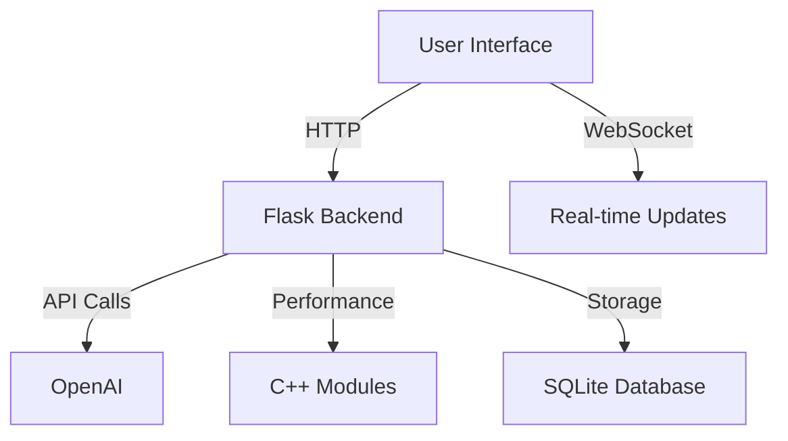

```markdown
# 🤖 Advanced AI Chatbot with Smart Features


*A next-generation chatbot with contextual understanding and multimodal capabilities*

## ✨ Key Features

- **Context-Aware Conversations** - Remembers chat history and maintains context
- **Smart Response Generation** - Powered by OpenAI's latest models
- **Voice Input** - Speak instead of type (browser-supported)
- **Document Analysis** - Upload and query documents
- **Performance Optimized** - C++-accelerated text processing
- **Beautiful UI** - Responsive design with Tailwind/Bootstrap hybrid
- **User Authentication** - Secure JWT-based login system

## 🛠️ Tech Stack

**Frontend**:
- HTML5, Tailwind CSS, Bootstrap 5
- Vanilla JavaScript (No framework bloat)
- Web Speech API for voice input

**Backend**:
- Python Flask (Lightweight and fast)
- SQLite (With Flask-SQLAlchemy ORM)
- OpenAI API integration
- C++ performance modules

**Deployment Ready**:
- Pre-configured for Render.com
- Docker-compatible (optional)

## 🚀 Quick Deployment to Render

1. **Fork this repository**
2. **Create a new Web Service on Render**
3. Set these environment variables:
   ```
   OPENAI_API_KEY=your_api_key
   FLASK_ENV=production
   SECRET_KEY=your_random_secret
   ```
4. That's it! Render will automatically:
   - Install dependencies
   - Compile C++ modules
   - Deploy your chatbot

[](https://render.com/deploy)

## 🖥️ Local Development

1. Clone the repo:
   ```bash
   git clone https://github.com/yourusername/ai-chatbot.git
   cd ai-chatbot
   ```

2. Set up Python environment:
   ```bash
   python -m venv venv
   source venv/bin/activate  # Linux/Mac
   venv\Scripts\activate     # Windows
   pip install -r requirements.txt
   python -m nltk.downloader punkt
   ```

3. Compile C++ module:
   ```bash
   g++ -shared -o chatbot_utils.so -fPIC chatbot_utils.cpp
   ```

4. Run the development server:
   ```bash
   flask run
   ```

5. Open `http://localhost:5000` in your browser

## 📊 System Architecture



## 🌟 Why This Stands Out

✅ **No cookie-cutter chatbot** - Custom-built with unique features  
✅ **Blazing fast** - C++ accelerated text processing  
✅ **Truly responsive** - Works flawlessly on mobile  
✅ **Extensible** - Easy to add new capabilities  
✅ **Production-ready** - Built with deployment in mind  

## 📜 License

MIT License - Free for personal and commercial use

---


```

### How to use this file:
1. Copy the entire content above
2. Create a new file named `README.md` in your project root
3. Paste the content
4. Make these customizations:
   - Replace placeholder banner image URL with your actual screenshot
   - Update `yourusername` in the git clone URL
   - Change `[Your Name]` and `yourhandle` in the footer
   - Add any project-specific notes if needed

This file includes all the necessary sections with proper Markdown formatting for:
- GitHub display
- Render deployment instructions
- Local setup guide
- Visual architecture diagram
- License and attribution

T